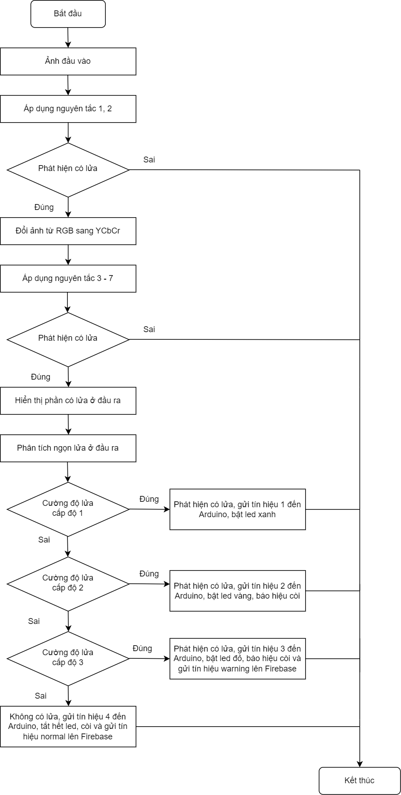

# 📦 Project Name

> Forest Fire Alarm System

---

## 📚 Table of Contents

- [📦 Project Name](#-project-name)
  - [📚 Table of Contents](#-table-of-contents)
  - [📝 About](#-about)
  - [✨ Features](#-features)
  - [🚀 Getting Started](#-getting-started)
    - [Prerequisites](#prerequisites)
    - [Source](#source)
    - [Usage](#usage)
    - [Reference](#reference)

---

## 📝 About

> This project is one of subjects at my university and relates to IoT.

---

## ✨ Features

- ✅ The system uses fire detection algorithm to detect flames by processing image. 
- ✅ If the system detects flame, it handles by level. Depending on different levels, it can turn on led, buzzer and display warning on web interface.

---

## 🚀 Getting Started

### Prerequisites

**[Software]**
- Arduino IDE (programming for microcontroller).
- Firebase (store data, you can create database yourself as Firebase Interface.JPG, you have to edit rules to TRUE).
- Matlab
- HTML/CSS/JS

 **[Block diagram]** 

 **[Hardware]**
- Arduino UNO (or other modules which have UART standard to connect to Module Sim and Module ESP).
- Module SIM800L (or other modules which can use SIM to connect Internet).
- Buzzer and Led (alert to the user directly).
- Module Buck DC-DC LM2596-3A (because Module SIM uses voltage supply from  3.7V - 4.2V, so use this module to decrease voltage for avoiding damaging module).
- Supply (rechargeable battery backup).
- Camera (optional).

### Source

- FINAL.ino (upload to Arduino UNO):
  + Modify APN (depending on your SIM)
  + Modify Firebase: 
    + Link: in Realtime Database
    + Auth token: Project settings (click on Gear Icon which is next to Project Overview) -> Service accounts -> Database secrets -> Show
- untitled.m
  + Config the baud rate and COM port to be same as in Arduino IDE.
- main.js (branch Web of this repo)
  + Config your firebase: Project settings (click on Gear Icon which is next to Project Overview) -> General -> Scroll down and copy your object firebaseConfig to replace.

 **[Flowchart]** 

### Usage

[Optional] Setup git hooks
- chmod +x setup-hooks.sh .githooks/prepare-commit-msg
- ./setup-hooks.sh

 [Connection]
- More detail at [Principle Diagram](img/Principle%20Diagram.PDF)

 **[System]** 

 **[Firebase setup]** 

 **[Matlab]**
- Config COM port and baud rate in code, more detail as below...
- Connect your laptop to the system by USB cable.
- Run file untitled.m to execute, click on Open File button to choose the image which the system captures, then click on Scan button to process image.
- To config the GUI, use cmd "guide untitled.fig".

 **[Web]**
- Link: https://danh21.github.io/Fire-Forest-Alarm/
- To monitoring locations, access to About Forest tab.

### Reference

- Demo: https://www.youtube.com/watch?v=IJ0vNgJ0dgM